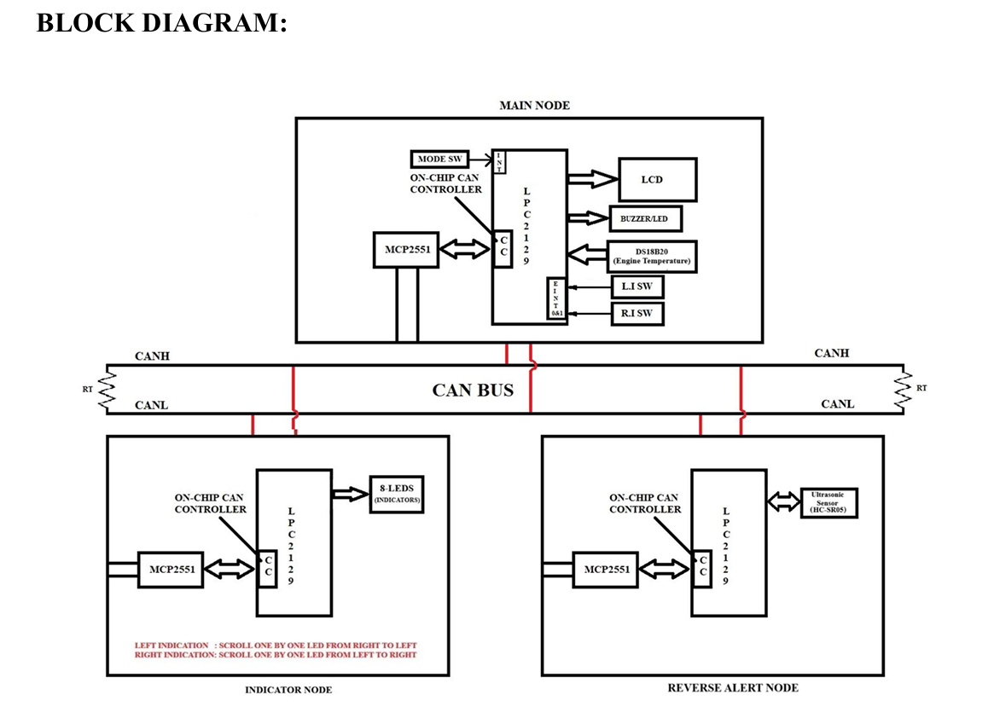

# 🚗 CAN-Based Vehicle Safety & Monitoring System

<p align="center">
  
</p>

<p align="center">
  
  
  
  
</p>

## 📖 Project Overview

This project implements a **CAN-Based Vehicle Safety & Monitoring System** using **LPC2129 ARM7 microcontrollers**. The system is designed to simulate an automotive network where multiple nodes communicate through the **Controller Area Network (CAN)** protocol to improve vehicle safety and monitoring.

The project demonstrates:

* 🌡️ Engine Temperature Monitoring
* 💡 Vehicle Indicator Control
* 🚨 Reverse Obstacle Detection
* 📡 Real-Time CAN Communication
* ⚡ Interrupt-Based Event Handling

---

## 🎯 Objectives

* Develop a distributed embedded system using CAN protocol.
* Monitor engine temperature using DS18B20 sensor.
* Control vehicle indicators through interrupt events.
* Detect obstacles during reverse mode using an ultrasonic sensor.
* Exchange data reliably between multiple nodes.

---

## 🏗️ System Architecture

### 🖥️ Main Node

Acts as the central controller of the system.

#### Responsibilities

* Read engine temperature from DS18B20 sensor
* Display status on LCD
* Process indicator interrupts
* Transmit CAN messages
* Receive reverse alert messages
* Generate safety alerts

---

### 💡 Indicator Node

Responsible for vehicle indicator control.

#### Responsibilities

* Receive CAN messages from Main Node
* Control Left Indicator
* Control Right Indicator
* Display indicator status using LEDs and custom LCD symbols

---

### 📏 Reverse Alert Node

Responsible for obstacle detection.

#### Responsibilities

* Measure obstacle distance using HC-SR05
* Compare distance with threshold value
* Send warning status to Main Node through CAN

---

## 🔄 Working Principle

### 🚗 Main Node

```text
Initialize System
        ↓
Read Temperature
        ↓
Display on LCD
        ↓
Check Interrupt Status
        ↓
Transmit CAN Message
        ↓
Receive Reverse Alert
        ↓
Generate Warning
```

### 💡 Indicator Node

```text
Initialize CAN
       ↓
Wait for Message
       ↓
Receive Command
       ↓
Control Indicators
```

### 📏 Reverse Alert Node

```text
Initialize Sensor
        ↓
Measure Distance
        ↓
Compare Threshold
        ↓
Send CAN Alert
```

---

## 🛠️ Hardware Components

| Component          | Description             |
| ------------------ | ----------------------- |
| LPC2129            | ARM7 Microcontroller    |
| MCP2551            | CAN Transceiver         |
| DS18B20            | Temperature Sensor      |
| HC-SR05            | Ultrasonic Sensor       |
| LCD 16x2           | Display Unit            |
| LEDs               | Indicator Simulation    |
| Push Buttons       | Interrupt Inputs        |
| USB-UART Converter | Programming & Debugging |

---

## 💻 Software Tools

* Embedded C
* Keil uVision
* Flash Magic

---

## ✨ Key Features

✅ Multi-Node CAN Communication

✅ Engine Temperature Monitoring

✅ Reverse Obstacle Detection

✅ Interrupt-Based Indicator Control

✅ Real-Time Safety Alerts

✅ LCD Status Display

✅ Automotive Embedded System Architecture

---

## 📂 Repository Structure

```text
CAN-Based-Vehicle-Safety-Monitoring-System
│
├── main_node/
│   ├── source files
│   └── project files
│
├── indicator_node/
│   ├── source files
│   └── project files
│
├── reverse_node/
│   ├── source files
│   └── project files
│
├── Images/
│   ├── block_diagram.jpg
│   ├── hardware_setup.jpg
│   ├── lcd_output.jpg
│   └── reverse_alert.jpg
│
├── Project_Report.pdf
└── README.md
```

---

## 📚 Technical Concepts Implemented

* ARM7 LPC2129 Programming
* Embedded C Development
* CAN Protocol Communication
* Interrupt Handling
* LCD Interfacing
* DS18B20 Interfacing
* Ultrasonic Sensor Interfacing
* Real-Time Embedded Systems

---

## 🚘 Applications

* Automotive Safety Systems
* Vehicle Monitoring Systems
* Reverse Parking Assistance
* Industrial Monitoring Systems
* Distributed Embedded Networks

---

## 🖼️ Project Demonstration

### 📊 Block Diagram


### 🔧 Hardware Setup


### 📟 LCD Output


### 🚨 Reverse Alert Detection


---

## 👩‍💻 Author

**Ankita More**

Embedded Systems Engineer
